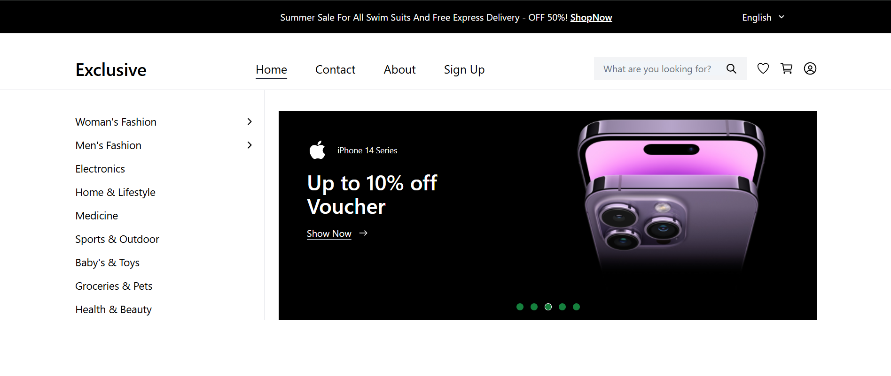

[Exclusive E-Commerce Website](https://exclusive-ecommerce-ten.vercel.app/)

# Exclusive E-Commerce Frontend Project

This is a functional E-Commerce frontend website built using the React library and styled with Tailwind CSS. It integrates API functionalities for user authentication and a dynamic cart system, providing a seamless shopping experience.

## Table of Contents

1. [Project Overview](#project-overview)
2. [Features](#features)
3. [Technologies Used](#technologies-used)
4. [API Integration](#api-integration)
5. [Getting Started](#getting-started)
6. [Acknowledgments](#acknowledgments)

## Project Overview

The Exclusive E-Commerce project is a frontend functional website designed using React and styled with Tailwind CSS. It provides users with the ability to browse products, manage a shopping cart, and complete a checkout process. The application integrates with an external API for user authentication and cart data management.

## Features

**User Authentication**: Integration with an API for user sign-in functionality.
**Responsive Design**: Ensures the website looks great on all devices.
**Dynamic Cart Management**: Add, update, and remove products in the cart.
**Product Listings**: Displays items with detailed descriptions.
**Minimalistic Styling**: Built with modern Tailwind CSS styling.
**Routing**: Seamless navigation between pages using React Router.

## Technologies Used

**React** - For building the user interface with reusable components.
**React-router-dom** - For page navigation and routing.
**Tailwind CSS** - For responsive and clean design.
**Axios** - For making HTTP requests to the backend API.
**Vite** - For a fast development environment and optimized builds.

## API Integration

The application communicates with the backend to handle the following:

**1. Sign-In Functionality:**

    - Sends user credentials to the API for authentication.
    - Manages user session information.

**2. Cart Data Management:**

    - Fetches and displays cart items from the API.
    - Updates cart contents dynamically as users add or remove products.

## Getting Started

### Prerequisites

To run this project locally, ensure you have:

    - Node.js installed on your machine.
    - A code editor (e.g., Visual Studio Code).

### Installation

**1. Clone the Repository:**

`git clone https://github.com/MintesinotN/Exclusive-Ecommerce.git`

**2. Navigate to the Project Directory:**

`cd Exclusive-Ecommerce`

**3. Install Dependencies:**

`npm install`

**4. Run the Development Server:**

`npm run dev`

Open your browser and navigate to the URL displayed in the terminal (e.g., `http://localhost:5173`).

## Acknowledgments

This project was developed as part of the Stage 3 Assignment for InterTecHub. Special thanks to the team for their guidance and support.